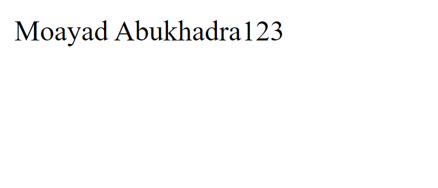
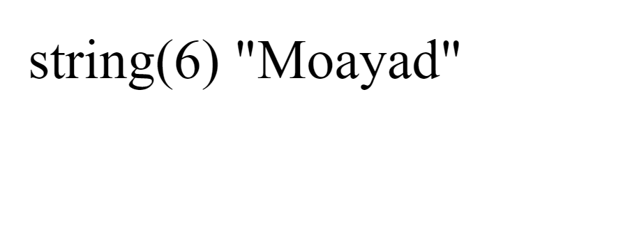
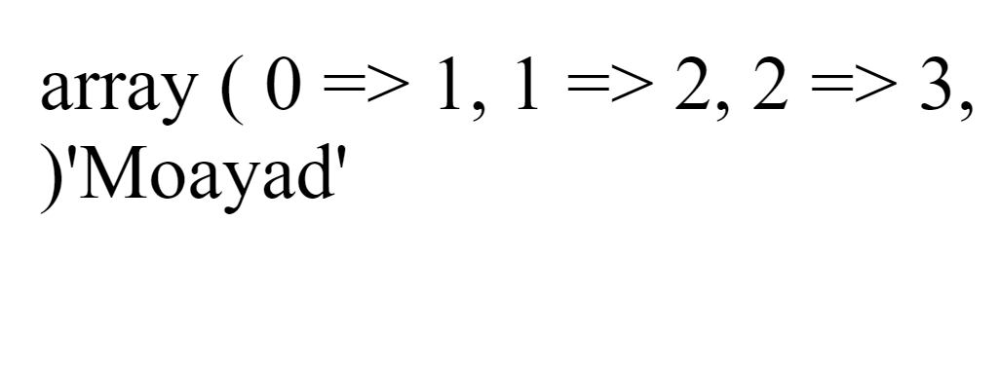

# php

## echo:

output - strings , numbers , array , html ,etc

- output multiple values.

Ex: 

```
<?php
$name = 'Moayad Abukhadra';
echo $name;
echo 1, 2 , 3;
?>
```

output:



## print:

- Works like echo but only takes one value.

Ex: 
```
<?php
$name = 'Moayad Abukhadra';
print $name
?>
```

output: 


## print_r():

- Used to print arrays, it shows the index with value.

Ex:
```
<?php
print_r([1,2,3])
?>
```

output:
.png)


## var_dumb:

- Returns the data with more info like the type and the length. 

Ex:
```
<?php
var_dump("Moayad")
?>
```

output: 


## var_export:

- return the data with the type. 

Ex:
```
<?php
var_export([1,2,3]);
var_export("Moayad");
?>
```

output:

